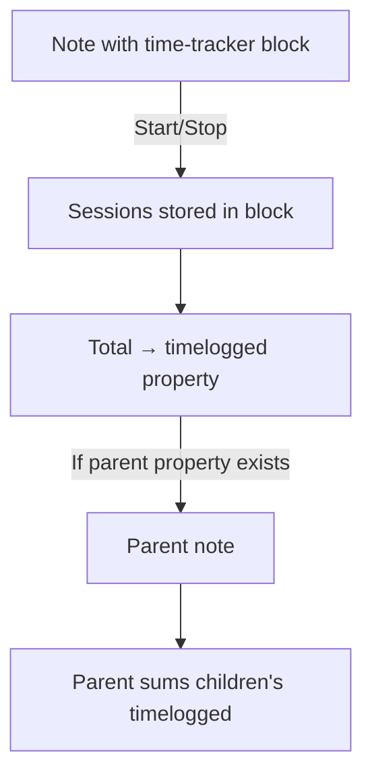

# Time Tracker

Track work sessions per note with start/stop timing and automatic parent rollup.

> [!WARNING]
> This plugin is provided **as-is** for personal use. The repository is public for anyone who wants to fork and adapt it.
> Please do not open issues for support or feature requests.

## Features

⏱️ **Per-note time tracking** — Start/stop sessions directly in any note

📊 **Session history** — View all recorded sessions with timestamps and durations

🔗 **Hierarchical rollup** — Child notes automatically sum into parent's `timelogged` property

✏️ **Inline storage** — Data lives in a code block within your note (no external database)

🔄 **Live sync** — Manual edits to the block automatically update frontmatter

## How It Works



## Usage

Add a code block to any note:

````markdown
```time-tracker

```
````

The plugin renders interactive Start/Stop controls. Sessions are stored as JSON inside the block:

```json
{
  "entries": [
    { "start": "2024-01-15T09:00:00Z", "end": "2024-01-15T10:30:00Z" },
    { "start": "2024-01-15T14:00:00Z", "end": "2024-01-15T15:45:00Z" }
  ],
  "activeStart": null
}
```

### Hierarchical Time Rollup

If a note has a `parent` property linking to another note, the parent's `timelogged` automatically includes all children:

```
Project A (timelogged: 5h 30m)
├── Task 1 (timelogged: 2h 15m)
└── Task 2 (timelogged: 3h 15m)
```

The parent property can use wiki-link syntax:

```yaml
parent: "[[Project A]]"
```

## Frontmatter

The plugin writes a `timelogged` property to each note:

| Property     | Description                                             |
| ------------ | ------------------------------------------------------- |
| `timelogged` | Total time (self + children), e.g. `2h 15m` or `45 min` |

## Installation

### Manual

1. Download `main.js` and `manifest.json` from the [Releases](../../releases) page
2. Create `.obsidian/plugins/time-tracker/` in your vault
3. Place the files in that folder
4. Enable the plugin in **Settings → Community plugins**

### BRAT

1. Install [Obsidian42 - BRAT](https://github.com/TfTHacker/obsidian42-brat)
2. Run `BRAT: Add a beta plugin for testing`
3. Enter this repository URL

## Images


## License

[MIT](LICENSE)
